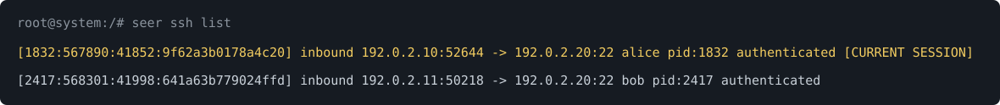

# seer

Extendable system enumeration and administration tool for linux

## Setup

### Installation

Building Seer requires Go 1.23 or newer. Check `go version` before building:
the Go package in a distribution's repositories may be older, even after
updating and upgrading packages. If needed, install a newer Go toolchain using
the [official Go instructions](https://go.dev/doc/install).

After cloning this repository run the following commands from the root level of the project:
```
go build -o seer
mv seer /usr/local/bin/
chmod +x /usr/local/bin/seer
```

### Completion

To generate an autocompletion script for your terminal use the `seer completion` command.

The following commands can be used to configure bash autocompletion:
```
apt update && apt install bash-completion -y
mkdir -p /etc/bash_completion.d/
seer completion bash > /etc/bash_completion.d/seer
source /usr/share/bash-completion/bash_completion
source /etc/bash_completion.d/seer
```

Load `bash_completion` before the Seer script in each Bash session that was
already open when the package was installed. It defines
`_get_comp_words_by_ref`, which the generated Seer script uses. New
interactive Bash sessions normally load it automatically. If Tab completion
reports `_get_comp_words_by_ref: command not found`, run the two `source`
commands above in that session. After updating Seer, install the new binary
before testing completion. `seer ssh -h` should show the SSH commands in that
binary. With completion active, `seer ssh describe` and `seer ssh end`
suggest visible session IDs. The `seer ssh keys describe` and
`seer ssh keys remove` commands suggest visible key fingerprints.

For other shells see `seer completion -h`

## Usage

Seer contains a number of subcommands for tasks ranging from querying system processes to expiring any user on the system that matches a regex pattern.

For a complete list of subcommands and options use `seer -h` and `seer [subcommand] -h`.

### Examples

List and describe processes
```
root@system:/# seer proc list
[1] /usr/bin/bash (/bin/bash) root 42s
[54] /usr/local/bin/seer (seerproclist) root 0s
root@system:/# seer proc describe 1
┌[1] /usr/bin/bash
├ cmdline: /bin/bash
├ state: S age: 65s
├ parent: 0
├ user: root  euid: 0
├ exe deleted: false
└ md5: 7063c3930affe123baecd3b340f1ad2c
```

List processes and related sockets:
```
root@system:/# seer proc ls --socket 
┬─[1] /usr/bin/bash (/bin/bash) root 98s
├┬[11] /usr/bin/nc.traditional (nc-lp42) root 83s
│└─<0> tcp 0.0.0.0:42 <- 0.0.0.0:0 (LISTEN) i:467275
├┬[43] /usr/bin/nc.traditional (nc192.168.42.180) root 4s
│└─<1> tcp 172.17.0.2:59626 -> 192.168.42.1:80 (ESTABLISHED) i:466804
└─[44] /usr/local/bin/seer (seerprocls--socket) root 0s
```

Show a process tree:
```
root@system:/# seer proc tree 
┬[1] /usr/bin/bash /bin/bash
├┬[9] /usr/bin/screen SCREEN-Sx
│└┬[10] /usr/bin/dash /bin/sh
│ └┬[11] /usr/bin/bash bash
│  └─[13] /usr/bin/nc.traditional nc-lp42
└─[47] /usr/local/bin/seer seerproctree
```

Describe the user `alice`
```
root@system:/# seer user describe alice
┌ alice (1000)
├ Home: /home/alice
├ Shell: /bin/sh
├ Primary Group: alice
├ Secondary Groups: [sudo]
├ Password: !
└ Expired: false
```

Expire any users whose name ends in `-contractor`
```
root@system:/# seer users expire -r "\-contractor$"
The following 2 user(s) will be modified:
  mallory-contractor
  bob-contractor
Continue? (yes/no): yes
Modified 2 user(s).
```

### SSH inspection and administration

On Linux, `seer ssh list` shows live SSH-owned TCP connections using `/proc`
socket and process information. An established connection is listed even if it
has no terminal or login record. `CURRENT SESSION` identifies the invoking
connection from `SSH_CONNECTION`, or from process ancestry when that value is
absent. Run as root
for the most complete process and socket visibility. In an interactive terminal,
the current connection is highlighted in yellow. The text marker remains when
color is disabled or output is redirected.

SSH output uses color to make the important parts easier to scan: cyan for
IDs, setting names, and field labels; yellow for review items and the current
connection; red for warnings and failed logins; and green for valid checks and
accepted logins. Output stays plain when redirected, when `TERM=dumb`, or
when `NO_COLOR` is set.

See [SSH command family](docs/ssh-architecture.md) for the data sources,
connection checks, and action safeguards behind these commands.

List and describe SSH connections:
```
root@system:/# seer ssh list
[1832:567890:41852:9f62a3b0178a4c20] inbound 192.0.2.10:52644 -> 192.0.2.20:22 alice pid:1832 authenticated [CURRENT SESSION]
[2417:568301:41998:641a63b779024ffd] inbound 192.0.2.11:50218 -> 192.0.2.20:22 bob pid:2417 authenticated
root@system:/# seer ssh describe 2417:568301:41998:641a63b779024ffd
┌ 2417:568301:41998:641a63b779024ffd (inbound)
├ Remote: 192.0.2.11:50218
├ Local: 192.0.2.20:22
├ Login user: bob
├ Process user: root
├ Login time: 2026-09-25 13:42
├ PID: 2417 (start ticks: 568301)
├ Network namespace: net:[4026531840]
├ Socket inode: 41998
├ Socket owners: 1
├ Command: sshd: bob [priv]
├ Authenticated: true
├ SSH listener matched: true
├ Current session: false
└ Sources: TCP socket, /proc/PID/fd, /proc/PID/stat, child SSH_CONNECTION, sshd listening socket, utmp (who)
```



Seer builds the bracketed session ID from the process ID, its start time, the
socket inode, and a hash of the network namespace and connection addresses.
Linux supplies these values through `/proc`; SSH does not assign this ID.
Seer uses them to check that an ID still refers to the same process and socket
before ending a connection. Copy a fresh ID from `ssh list` before acting.

End an SSH connection using an ID from `ssh list`:
```
root@system:/# seer ssh end 2417:568301:41998:641a63b779024ffd
┌ 2417:568301:41998:641a63b779024ffd (inbound)
├ Remote: 192.0.2.11:50218
├ Local: 192.0.2.20:22
├ Login user: bob
├ Process user: root
├ Login time: 2026-09-25 13:42
├ PID: 2417 (start ticks: 568301)
├ Network namespace: net:[4026531840]
├ Socket inode: 41998
├ Socket owners: 1
├ Command: sshd: bob [priv]
├ Authenticated: true
├ SSH listener matched: true
├ Current session: false
└ Sources: TCP socket, /proc/PID/fd, /proc/PID/stat, child SSH_CONNECTION, sshd listening socket, utmp (who)
Ending this SSH connection may disconnect multiple sessions or forwards.
Continue? (yes/no): yes
SSH connection close requested.
```

`ssh end` rechecks the process and socket before acting. On supported Linux
kernels it shuts down the selected socket, including when two SSH processes
hold it. If socket access is unavailable, it can send SIGTERM to a single
verified owner that does not also own a listener or another established TCP
connection. An SSH listener is
not required for a server launched by `inetd`.

Attempt to end your own SSH connection:

```
root@system:/# seer ssh end 1832:567890:41852:9f62a3b0178a4c20 --yes
┌ 1832:567890:41852:9f62a3b0178a4c20 (inbound)
├ Remote: 192.0.2.10:52644
├ Local: 192.0.2.20:22
├ Login user: alice
├ Process user: root
├ Login time: 2026-09-25 13:40
├ PID: 1832 (start ticks: 567890)
├ Network namespace: net:[4026531840]
├ Socket inode: 41852
├ Socket owners: 1
├ Command: sshd: alice [priv]
├ Authenticated: true
├ SSH listener matched: true
├ Current session: true
└ Sources: TCP socket, /proc/PID/fd, /proc/PID/stat, child SSH_CONNECTION, sshd listening socket, current process ancestry or SSH_CONNECTION, utmp (who)
Ending this SSH connection may disconnect multiple sessions or forwards.
WARNING: This is your current SSH connection. Ending it will disconnect this terminal.
--yes does not skip confirmation for a possible current connection.
End this possible current connection? (yes/no): yes
Confirm again to end this SSH connection? (yes/no): no
Canceled.
```


Ending your own connection requires `yes` at both prompts, even with `--yes`.
Answering `no` at either prompt cancels the action. The warning appears red in
an interactive terminal and stays plain text when color is unavailable. Ending
an SSH connection requires Linux amd64 or arm64 with pidfd support.

List SSH server rules and check effective settings for `alice`:
```
root@system:/# seer ssh config list
/etc/ssh/sshd_config:8 PubkeyAuthentication yes
/etc/ssh/sshd_config:9 AuthorizedKeysFile .ssh/authorized_keys
/etc/ssh/sshd_config:12 Include /etc/ssh/sshd_config.d/*.conf
/etc/ssh/sshd_config.d/50-site.conf:3 PermitRootLogin no
/etc/ssh/sshd_config.d/50-site.conf:4 PasswordAuthentication yes
/etc/ssh/sshd_config.d/50-site.conf:8 Match User alice Address 192.0.2.*
/etc/ssh/sshd_config.d/50-site.conf:9 PasswordAuthentication no
root@system:/# seer ssh config check --user alice --addr 192.0.2.10
SSH configuration syntax: valid
... additional effective settings omitted ...
allowtcpforwarding no
passwordauthentication no
permitrootlogin no
Running sshd PID 820 (listener): /usr/sbin/sshd -D
  Listening: 0.0.0.0:22
Note: effective settings above read the file on disk; a running daemon may have loaded earlier contents.
```

The effective settings output is shortened here.

`config check` runs `sshd -t` and `sshd -T`. Its findings are review prompts;
the right SSH policy depends on the host. Use `--file` for a nonstandard
server configuration file. Supply `--user` and `--addr` to check `Match` rules;
`--host`, `--laddr`, and `--lport` are available when needed.
The runtime lines show visible SSH listener processes and their command-line
overrides. They do not prove that the daemon has reloaded the file on disk.

List and describe authorized keys for `bob`:
```
root@system:/# seer ssh keys list --user bob
bob SHA256:jsbmXD9MxXonCbWzUj0vT8eXuAITY03X2W1s5fjse/Y ssh-ed25519 /home/bob/.ssh/authorized_keys:2 bob@laptop
bob SHA256:V1Q9DCu5TjXcqpw9jOUpBFoJdrQXzwuy9+U55GfCEKU ssh-ed25519 /home/bob/.ssh/authorized_keys:5 bob@desktop
root@system:/# seer ssh keys describe SHA256:jsbmXD9MxXonCbWzUj0vT8eXuAITY03X2W1s5fjse/Y --user bob
┌ bob SHA256:jsbmXD9MxXonCbWzUj0vT8eXuAITY03X2W1s5fjse/Y
├ Type: ssh-ed25519
├ File: /home/bob/.ssh/authorized_keys:2
├ Options:
└ Comment: bob@laptop
```

Remove one authorized key using a fingerprint from the list:
```
root@system:/# seer ssh keys remove SHA256:jsbmXD9MxXonCbWzUj0vT8eXuAITY03X2W1s5fjse/Y --user bob
┌ bob SHA256:jsbmXD9MxXonCbWzUj0vT8eXuAITY03X2W1s5fjse/Y
├ Type: ssh-ed25519
├ File: /home/bob/.ssh/authorized_keys:2
├ Options:
└ Comment: bob@laptop
Continue? (yes/no): yes
Backup: /home/bob/.ssh/.seer-keys-backup-abc123
Removed one authorized key entry.
```

If a fingerprint occurs more than once, use `--path` and `--line` from the
key list to select one entry for `keys describe` or `keys remove`.

The key commands use NSS accounts where `getent` is available and consult
`sshd -T` for authorized key file paths. When that is unavailable, they check
standard files in each home directory and print a warning. A removal saves a
backup in the same directory and preserves the other entries. Removal requires
the effective `sshd` configuration to be available. If the key
belongs to the current SSH account, removal requires
`--allow-current-access`. The same override is required if the command is
running inside SSH or has an incomplete connection scan and cannot identify
the current login.

Show other SSH authentication sources for one account:
```
root@system:/# seer ssh keys sources --user bob
Authentication sources for bob:
AuthorizedKeysFile: /home/bob/.ssh/authorized_keys
AuthorizedKeysCommand: /usr/local/bin/key-lookup %u (user: nobody; external keys not enumerated)
TrustedUserCAKeys: /etc/ssh/user_ca_keys.pub
  CA: SHA256:7vxZcXuZmxo7PQnZj7vJxZiGlyIwcRHDf8mmAyifHpA
AuthorizedPrincipalsFile: /home/bob/.ssh/authorized_principals
  Principal: bob
HostKey: /etc/ssh/ssh_host_ed25519_key mode:0600 SHA256:lxiZarNPnMxOtyhAdUEHI36yfPoDaSZ3jNUzQWgxypo
StrictModes: yes
```

`keys sources` reads file-based CA keys, principal entries, and public host-key
fingerprints. It reports external lookup commands without running them.

Show SSH daemon events and system login records:
```
root@system:/# seer ssh history --limit 30
SSH daemon journal entries (all types):
2026-09-25T13:42:08+0000 system sshd[2417]: Accepted publickey for bob from 192.0.2.11 port 50218 ssh2
root@system:/# seer ssh history --failed --limit 30
SSH daemon journal entries (failed authentication):
2026-09-25T13:40:02+0000 system sshd[2501]: Failed password for invalid user guest from 192.0.2.12 port 51000 ssh2
System login records (btmp; not SSH-specific):
guest    ssh:notty    192.0.2.12      Fri Sep 25 13:40 - 13:40  (00:00)
```

`--failed` selects common failed authentication messages from SSH daemon
journal and text logs, plus failed system login records when available. Log
sources vary by distro. Seer also reads numbered and gzip-compressed log
rotations and suppresses matching journal/text duplicates. System `wtmp` and `btmp`
records are not SSH-specific and do not establish whether a connection is
still active.
